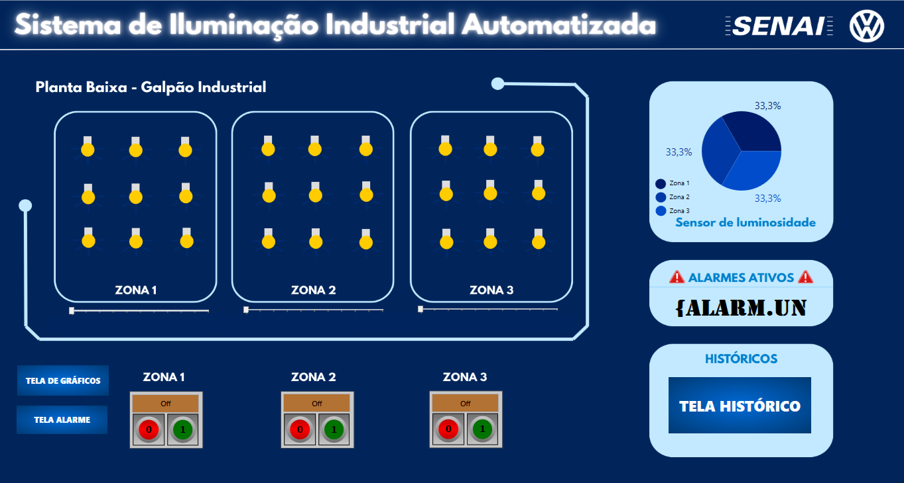

  

# 💡 Projeto — Sistema de Iluminação Industrial Automatizada
Sistema Supervisório desenvolvido no BluePlant

Esta pasta contém todos os arquivos, telas, animações, relatórios e documentação
referentes ao **Sistema de Iluminação Industrial Automatizada**, desenvolvido pelos
alunos do Curso Técnico em Mecatrônica durante a unidade de Sistemas Supervisórios,
utilizando o software **BluePlant**.

O objetivo do projeto é criar uma solução supervisória para monitorar e controlar
um sistema de iluminação industrial com sensores, luminárias, alarmes e indicadores,
simulando uma aplicação real de automação.

---

## 🔍 1. Descrição do Processo

O processo representa um **sistema de iluminação industrial** composto por:

- Luminárias automatizadas  
- Sensores de luminosidade e presença  
- Comandos manuais e automáticos  
- Indicadores digitais e luminosos  
- Alarmes de falha e condições anormais  

O supervisório desenvolvido no BluePlant deve permitir:

- Monitoramento em tempo real  
- Controle de liga/desliga  
- Visualização gráfica das luminárias  
- Registro de eventos e tendências  

---

## 🖥️ 2. Telas do Sistema

As telas obrigatórias do projeto incluem:

### 🟦 **Tela Principal**
- Visão geral do sistema de iluminação  
- Representação das luminárias  
- Indicadores do estado atual  
- Elementos gráficos animados  

### 🟩 **Tela de Controle (botoeira virtual)**
- Botões de comando (Liga/Desliga)  
- Seletor Automático/Manual  
- Sensores associados  
- Navegação entre telas  

### 🔴 **Tela de Alarmes**
- Alarmes ativos  
- Histórico de ocorrências  
- Classificação por severidade  

### 📈 **Tela de Históricos / Tendências**
- Registro de variáveis como:
  - Intensidade luminosa  
  - Estado de luminárias  
  - Número de acionamentos  

### 📄 **Tela de Relatórios**
- Dados consolidados por turno, dia ou evento  
- Totais de acionamentos  
- Informações gerais do processo  

---

## 🎞️ 3. Animações (mínimo exigido: 3)

O projeto deve incluir pelo menos três animações industriais, como:

- Luminárias acendendo/apagando  
- Indicadores luminosos (verde, vermelho, amarelo)  
- Sensores atuando graficamente  
- Movimento ou transição de intensidade  

---

## 🚨 4. Alarmes

Devem ser configurados alarmes relevantes ao processo, como:

- Falha em luminária  
- Ausência de resposta do sensor  
- Luminosidade fora da faixa desejada  
- Superaquecimento (se implementado)  

---

## 📊 5. Históricos / Tendências

Variáveis recomendadas para registro:

- Intensidade luminosa  
- Estado das luminárias  
- Quantidade de acionamentos  
- Eventos de falha  

O gráfico deve permitir análise ao longo do tempo para diagnóstico de operação.

---

## 📝 6. Relatórios

O sistema deve permitir a geração de relatório contendo:

- Data e hora da criação  
- Variáveis principais do processo  
- Totais acumulados (exemplo: acionamentos por turno)  
- Eventos importantes registrados  

Formatos possíveis:
- Diário  
- Por turno  
- Por evento  

---

## 🎤 7. Entrega Final

Cada grupo deve entregar:

1. **Projeto funcional completo no BluePlant**  
2. **Apresentação (5–10 minutos)** demonstrando:
   - Navegação entre telas  
   - Funcionamento das luminárias  
   - Animações implementadas  
   - Demonstração de **pelo menos 1 alarme**  
   - Gráficos de tendência em operação  
   - Geração do relatório final  
   - Estrutura e lógica do projeto  

---

## 📂 8. Conteúdo Desta Pasta

Aqui você encontrará:

- Arquivos do projeto BluePlant  
- Capturas de tela e animações  
- Relatórios gerados  
- Documentação do processo  
- Este README explicativo  

---

## 👨‍🏫 Professor Responsável  
**Adilson Cunha Rusteiko**  
Automação • Robótica • Programação • SCADA  
Curso Técnico em Mecatrônica

