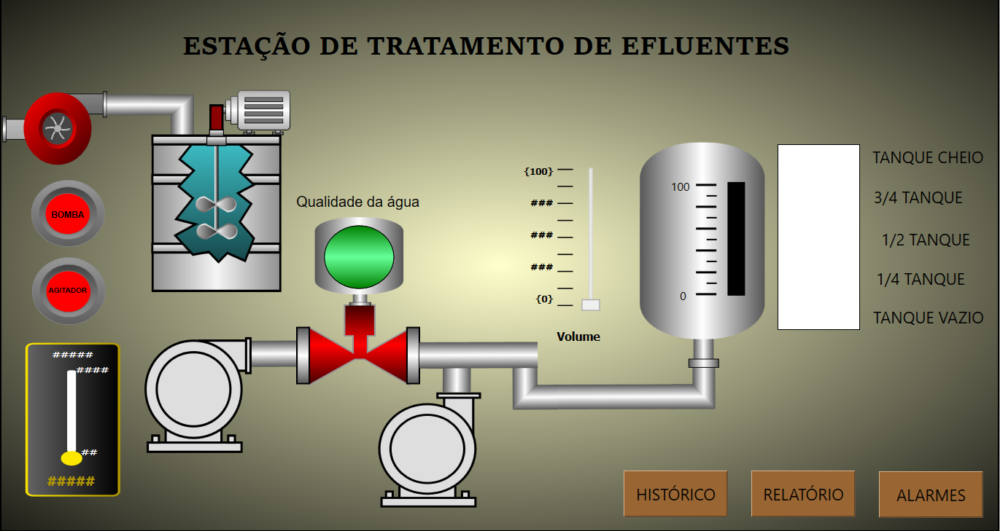

  

# 💧 Situação 1 — Estação de Tratamento de Efluentes  
Projeto Supervisório no BluePlant

Este projeto apresenta o desenvolvimento de um sistema supervisório completo para a
**Estação de Tratamento de Efluentes**, utilizando o software **BluePlant**, com foco
em tanques de decantação, bombas, válvulas, alarmes, históricos e relatórios.

O objetivo principal é aplicar conceitos fundamentais de SCADA/IHM em um processo industrial
realista, reforçando animações, alarmes, controle e monitoramento.

---

## 🔍 1. Descrição do Processo

A Estação de Tratamento de Efluentes é composta por:

- Tanque de entrada  
- Tanques de decantação  
- Bombas de recalque  
- Válvulas manuais e automáticas  
- Sensor de pH  
- Linha de saída de água tratada  

### ✔ Recursos obrigatórios implementados

**Animações:**
- Tanques enchendo e esvaziando  
- Válvulas abrindo e fechando  
- Bombas em funcionamento (giro, fluxo, status)

**Alarmes:**
- Nível alto no tanque de entrada  
- Bomba em falha  
- pH fora da faixa adequada  

**Históricos:**
- pH da água  
- Estado das bombas  

**Relatório:**
- Qualidade da água por turno:
  - pH médio  
  - Turbidez  
  - Total de ciclos de bombas  

---

## 🖥️ 2. Telas do Processo

O grupo deve desenvolver as seguintes telas:

### 🟦 **Tela Principal**
- Visão geral da ETE  
- Tanques animados  
- Bombas e válvulas com status  
- Indicadores digitais e analógicos  

### 🟩 **Tela de Controle**
- Botoeiras virtuais (liga/desliga)  
- Comandos das bombas  
- Abertura/fechamento de válvulas  
- Indicadores de pH  

### 🔴 **Tela de Alarmes**
- Lista de alarmes ativos  
- Histórico de ocorrências  
- Sinalização com cores padrão industrial  
  - Vermelho (crítico)  
  - Amarelo (atenção)  
  - Verde (normal)

### 📈 **Tela de Históricos / Tendências**
- Tendência do pH da água  
- Estado das bombas  
- Nível dos tanques (opcional)

### 📄 **Tela de Relatório**
- pH médio por turno  
- Turbidez média  
- Bombeamento total  
- Geração de arquivo ou visualização em tela  

### ✔ Itens obrigatórios em todas as telas
- Objetos gráficos animados  
- Indicadores digitais e analógicos  
- Botões de navegação  
- Layout industrial padronizado e organizado  

---

## 🎞️ 3. Animações

O projeto deve incluir **pelo menos 3 animações**, como:

- Tanque enchendo/esvaziando (barras ou gráfico)  
- Bomba girando / fluxo de água  
- Válvula abrindo e fechando  
- Luzes indicadoras (verde, amarelo, vermelho)  

---

## 🚨 4. Alarmes

Alarmes relevantes para o processo, como:

- Nível baixo / alto no tanque  
- Bomba com falha  
- pH fora da faixa ideal  
- Sensor desconectado  

---

## 👨‍🏫 Professor Responsável
**Adilson Cunha Rusteiko**  
Professor de Robótica Industrial • SCADA • Python  
CFP Volkswagen e Centro Universitário FIAP

